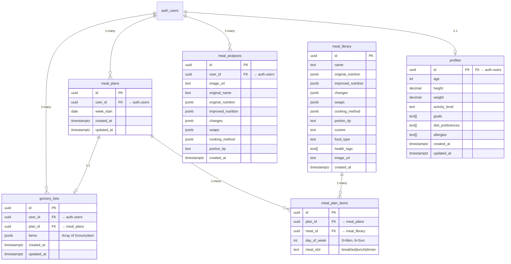

<![CDATA[# Database Schema & Data Model

This document provides a comprehensive reference for the HealthySwap database schema, table relationships, Row Level Security (RLS) policies, indexing strategy, and seed data management.

---

## Entity-Relationship Diagram



---

## Table Reference

### `profiles`

Stores user health and dietary information. Created when a user first accesses their profile page.

| Column | Type | Constraints | Description |
|---|---|---|---|
| `id` | `uuid` | PK, FK → `auth.users(id)` ON DELETE CASCADE | User's auth ID |
| `age` | `integer` | Nullable | User's age |
| `height` | `decimal` | Nullable | Height (cm) |
| `weight` | `decimal` | Nullable | Weight (kg) |
| `activity_level` | `text` | Nullable | Sedentary, Lightly Active, Moderately Active, Very Active |
| `goals` | `text[]` | Default `[]` | e.g., Weight Loss, Muscle Gain, Heart Health |
| `diet_preferences` | `text[]` | Default `[]` | e.g., Vegetarian, Vegan, Keto |
| `allergies` | `text[]` | Default `[]` | e.g., Nuts, Gluten, Dairy |
| `created_at` | `timestamptz` | NOT NULL, default `now()` | Creation timestamp |
| `updated_at` | `timestamptz` | NOT NULL, default `now()` | Last update timestamp |

### `meal_analyses`

Stores results from AI-powered meal analysis. One row per analysis request.

| Column | Type | Constraints | Description |
|---|---|---|---|
| `id` | `uuid` | PK, default `uuid_generate_v4()` | Analysis ID |
| `user_id` | `uuid` | FK → `auth.users(id)` ON DELETE CASCADE | Owning user |
| `image_url` | `text` | Nullable | URL of uploaded meal image |
| `original_name` | `text` | NOT NULL | User's input meal name |
| `original_nutrition` | `jsonb` | NOT NULL | `{ name, calories, protein, carbs, fat, fiber, sugar, factors[] }` |
| `improved_nutrition` | `jsonb` | NOT NULL | `{ name, calories, protein, carbs, fat, fiber, sugar }` |
| `changes` | `jsonb` | NOT NULL | `[{ label, change: "up"|"down", percentage }]` |
| `swaps` | `jsonb` | NOT NULL | `[{ original, replacement, benefit }]` |
| `cooking_method` | `jsonb` | NOT NULL | `{ original, improved, benefit }` |
| `portion_tip` | `text` | Nullable | Practical portion advice |
| `created_at` | `timestamptz` | NOT NULL, default `now()` | Analysis timestamp |

### `meal_library`

Public-read collection of pre-analyzed healthy meal transformations. Populated by Prisma seed script.

| Column | Type | Constraints | Description |
|---|---|---|---|
| `id` | `uuid` | PK, default `uuid_generate_v4()` | Meal ID |
| `name` | `text` | NOT NULL | Healthier meal name |
| `original_nutrition` | `jsonb` | NOT NULL | Original (unhealthy) version nutrition |
| `improved_nutrition` | `jsonb` | NOT NULL | Improved version nutrition |
| `changes` | `jsonb` | NOT NULL | List of changes made |
| `swaps` | `jsonb` | NOT NULL | Ingredient swap details |
| `cooking_method` | `jsonb` | NOT NULL | Cooking method comparison |
| `portion_tip` | `text` | Nullable | Portion control advice |
| `cuisine` | `text` | Nullable | e.g., North Indian, Japanese, Mexican |
| `food_type` | `text` | Nullable | Dish, Snack, Beverage, Dessert |
| `health_tags` | `text[]` | Default `[]` | e.g., High Protein, Weight Loss |
| `image_url` | `text` | Nullable | Meal image URL |
| `created_at` | `timestamptz` | NOT NULL, default `now()` | Entry creation date |

### `meal_plans`

Stores weekly meal plan headers. One plan per user per week.

| Column | Type | Constraints | Description |
|---|---|---|---|
| `id` | `uuid` | PK, default `uuid_generate_v4()` | Plan ID |
| `user_id` | `uuid` | NOT NULL, FK → `auth.users(id)` ON DELETE CASCADE | Owning user |
| `week_start` | `date` | NOT NULL | Monday of the plan week |
| `created_at` | `timestamptz` | NOT NULL, default `now()` | Creation timestamp |
| `updated_at` | `timestamptz` | NOT NULL, default `now()` | Last update |
| | | UNIQUE(`user_id`, `week_start`) | One plan per user per week |

### `meal_plan_items`

Individual meal assignments within a weekly plan.

| Column | Type | Constraints | Description |
|---|---|---|---|
| `id` | `uuid` | PK, default `uuid_generate_v4()` | Item ID |
| `plan_id` | `uuid` | NOT NULL, FK → `meal_plans(id)` ON DELETE CASCADE | Parent plan |
| `meal_id` | `uuid` | NOT NULL, FK → `meal_library(id)` ON DELETE CASCADE | Referenced meal |
| `day_of_week` | `integer` | NOT NULL, CHECK 0-6 | 0=Monday, 6=Sunday |
| `meal_slot` | `text` | NOT NULL, CHECK IN ('breakfast','lunch','dinner') | Meal time |
| | | UNIQUE(`plan_id`, `day_of_week`, `meal_slot`) | One meal per slot |

### `grocery_lists`

Auto-generated shopping lists derived from meal plans.

| Column | Type | Constraints | Description |
|---|---|---|---|
| `id` | `uuid` | PK, default `uuid_generate_v4()` | List ID |
| `user_id` | `uuid` | NOT NULL, FK → `auth.users(id)` ON DELETE CASCADE | Owning user |
| `plan_id` | `uuid` | NOT NULL, FK → `meal_plans(id)` ON DELETE CASCADE | Source plan |
| `items` | `jsonb` | NOT NULL, default `[]` | `[{ name, category, quantity, unit, checked }]` |
| `created_at` | `timestamptz` | NOT NULL, default `now()` | Creation timestamp |
| `updated_at` | `timestamptz` | NOT NULL, default `now()` | Last update |
| | | UNIQUE(`plan_id`) | One grocery list per plan |

---

## JSONB Schemas

### `original_nutrition` / `improved_nutrition`
```json
{
  "name": "Butter Chicken with Naan",
  "calories": 820,
  "protein": 36,
  "carbs": 45,
  "fat": 55,
  "fiber": 4,
  "sugar": 8,
  "factors": ["High in saturated fat", "Heavy cream"]
}
```

### `changes` (in `meal_analyses`)
```json
[
  { "label": "Calories", "change": "down", "percentage": 41 },
  { "label": "Protein", "change": "up", "percentage": 20 }
]
```

### `swaps`
```json
[
  {
    "original": "Heavy cream & butter",
    "replacement": "Greek yogurt",
    "benefit": "Cuts fat by 60%, adds probiotics"
  }
]
```

### `cooking_method`
```json
{
  "original": "Pan-fried with butter",
  "improved": "Grilled/Tandoori",
  "benefit": "Eliminates excess oil while maintaining flavor through spices"
}
```

### `items` (in `grocery_lists`)
```json
[
  {
    "name": "Greek yogurt",
    "category": "Dairy",
    "quantity": 2,
    "unit": "pack",
    "checked": false
  }
]
```

---

## Row Level Security Policies

All tables have RLS enabled. Policies enforce user-level data isolation.

### `profiles`
| Policy | Operation | Rule |
|---|---|---|
| Users can view own profile | SELECT | `auth.uid() = id` |
| Users can update own profile | UPDATE | `auth.uid() = id` |
| Users can insert own profile | INSERT | `auth.uid() = id` |

### `meal_analyses`
| Policy | Operation | Rule |
|---|---|---|
| Users can view own analyses | SELECT | `auth.uid() = user_id` |
| Users can insert own analyses | INSERT | `auth.uid() = user_id` |
| Users can delete own analyses | DELETE | `auth.uid() = user_id` |

### `meal_library`
| Policy | Operation | Rule |
|---|---|---|
| Anyone can view meal library | SELECT | `true` (public read) |

### `meal_plans`
| Policy | Operation | Rule |
|---|---|---|
| Users can CRUD own meal plans | SELECT/INSERT/UPDATE/DELETE | `auth.uid() = user_id` |

### `meal_plan_items`
| Policy | Operation | Rule |
|---|---|---|
| Users can CRUD own items | SELECT/INSERT/UPDATE/DELETE | EXISTS check against `meal_plans.user_id = auth.uid()` |

### `grocery_lists`
| Policy | Operation | Rule |
|---|---|---|
| Users can CRUD own grocery lists | SELECT/INSERT/UPDATE/DELETE | `auth.uid() = user_id` |

### `storage.objects` (meal-images bucket)
| Policy | Operation | Rule |
|---|---|---|
| Anyone can view meal images | SELECT | `bucket_id = 'meal-images'` |
| Authenticated users can upload | INSERT | `bucket_id = 'meal-images' AND auth.role() = 'authenticated'` |

---

## Indexes

| Table | Index | Columns |
|---|---|---|
| `meal_plan_items` | `meal_plan_items_plan_id_idx` | `plan_id` |
| `grocery_lists` | `grocery_lists_user_id_idx` | `user_id` |

Primary keys and unique constraints automatically create indexes.

---

## Seeding the Database

The meal library is seeded using Prisma ORM with the `@prisma/adapter-pg` driver adapter.

### Seed Files
| File | Content |
|---|---|
| `prisma/seed.ts` | Main seed script — clears existing data, inserts 10 base meals + 3 batches |
| `prisma/new_meals.ts` | Batch 1: ~20 additional meals |
| `prisma/new_meals_2.ts` | Batch 2: ~12 additional meals |
| `prisma/new_meals_3.ts` | Batch 3: ~18 additional meals |
| `seed_meal_library.sql` | Alternative SQL-based seed (standalone) |

### Running the Seed

```bash
# Ensure DIRECT_URL is set in .env
npx prisma db seed
```

The seed script:
1. Connects to PostgreSQL via `DIRECT_URL` (direct connection, not pooled)
2. Clears all existing `meal_library` records to prevent duplicates
3. Inserts 10 base meals individually (with full data structures)
4. Bulk-inserts remaining meals from `new_meals`, `new_meals_2`, `new_meals_3` via `createMany`

### Client-Side Fallback

If the Supabase query fails (e.g., no database configured), the `MealLibrary` component falls back to `src/app/data/mealLibrary.ts`, which contains 24 hardcoded meals with computed nutrition scores.

---

## Prisma Schema Mapping

The Prisma schema (`prisma/schema.prisma`) maps to Supabase PostgreSQL tables using `@@map()` annotations:

| Prisma Model | PostgreSQL Table |
|---|---|
| `Profile` | `profiles` |
| `MealAnalysis` | `meal_analyses` |
| `MealLibrary` | `meal_library` |
| `MealPlan` | `meal_plans` |
| `MealPlanItem` | `meal_plan_items` |
| `GroceryList` | `grocery_lists` |

Column names are mapped from camelCase (TypeScript) to snake_case (PostgreSQL) via `@map()` annotations.
]]>
